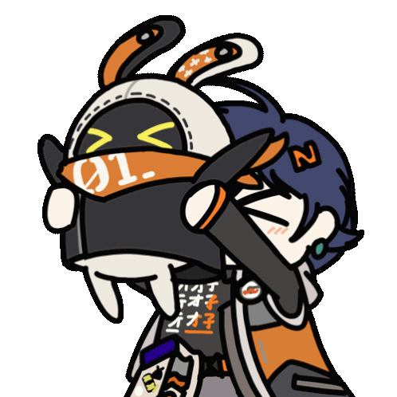
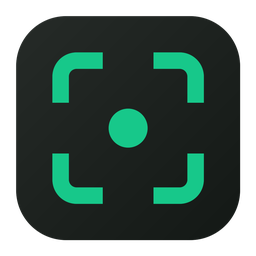
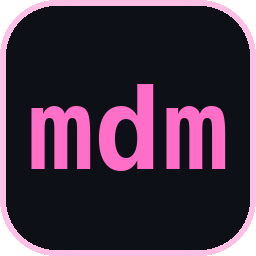
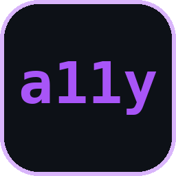
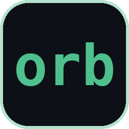
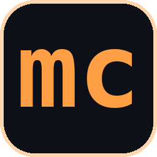
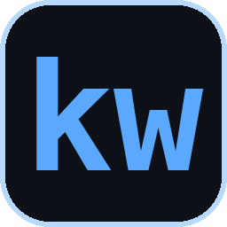

<!-- ASSET LOCALI (tutto servito dal tuo repo, zero dipendenze esterne):
       assets/zzz.gif        498x498, 4 frame, 154KB
       assets/logos/*.png    marchi dei progetti, 256x256
     snapkit.png è la sua icona vera (build/icon.png del repo).
     Gli altri sono marchi generati: riusabili come favicon nei
     rispettivi progetti, dove oggi c̀è ancora quella di default
     di create-next-app. -->

<p align="center">
  
  <a href="README.en.md"></a>
</p>

<p align="center">
  
</p>

<p align="center">
  
</p>

<p align="center">
  <a href="https://www.simoneriva.it"></a>
  <a href="https://www.linkedin.com/in/simone-riva-44a873411/"></a>
  <a href="mailto:simone@simoneriva.it"></a>
</p>

---

## Chi sono

Costruisco interfacce web con focus su architetture component-driven, design system scalabili e performance percepita. Un'interfaccia ben fatta è invisibile quando funziona, e memorabile quando non si limita a farlo.

```ts
const simone: Developer = {
  role:  "Senior Frontend Developer",
  focus: ["AI × FE R&D", "Design Systems"],
  based: "Italia",

  stack: {
    core:  ["TypeScript", "JavaScript"],
    ui:    ["React", "Vue", "Next", "Nuxt"],
    build: ["Vite", "Tailwind", "Node", "PWA"],
    also:  ["Rust"],
  },

  architecture: [
    "component-driven",
    "composition-first",
    "componenti trattati come API",
  ],

  cares: {
    a11y:   "WCAG 2.2 AA · ARIA · focus",
    perf:   "Core Web Vitals · SSR/SSG/ISR",
    ai:     "chat UI · streaming · MCP",
    motion: "intento, non decorazione",
  },

  offline: ["retro gaming", "chitarra", "日本語"],
};
```

---

## Stack

<p align="center">
  
</p>

---

## Progetti

> [!IMPORTANT]
> **Il lavoro di cui vado più fiero non è qui.** Sviluppo prodotti per
> aziende: il codice che va in produzione resta di proprietà del
> committente e non è pubblicabile. Vale anche per due piattaforme
> che ho costruito su commessa per clienti.
>
> Quelli che seguono sono i progetti che porto avanti per conto mio.
> Del resto posso parlarti volentieri — [scrivimi](mailto:simone@simoneriva.it).

###  [snapkit](https://github.com/simiriva95/snapkit)


<p>
  
  
  
</p>

Screenshot tool developer-first con auto-redaction locale dei secrets. Cattura, annota, reda, registra — niente lascia mai il dispositivo.

###  [mdm](https://github.com/simiriva95/mdm)

<p>
  
  
  
</p>

Mini downloader configurabile, scritto in Rust. Piccolo e single-purpose.

<!-- Per il campo "Description" del repo su GitHub (in inglese, come snapkit e orbit):
     Small configurable downloader written in Rust. -->

###  [accessibility-auditor](https://github.com/simiriva95/accessibility-auditor)

<p>
  
  
  
  
</p>

Analizza pagine web e trova problemi WCAG 2.2 (A/AA/AAA) con fix concreti. Contrasti calcolati in modo deterministico, AI opzionale per spiegazioni e codice.

###  [orbit](https://github.com/simiriva95/orbit)

<p>
  
  
  
</p>

Prenota una call di 30 minuti su un calendario 3D. Next.js 16 + React Three Fiber + Neon Postgres, disponibilità modellata come regola e non come righe.

###  [microcopy-generator](https://github.com/simiriva95/microcopy-generator)

<p>
  
  
  
</p>

Genera headline, sottotitoli e CTA per landing page in varianti A/B con razionale UX, stili grafici e anteprima hero. Next.js + Groq.

###  [keywriter](https://github.com/simiriva95/keywriter)

<p>
  
  
  
</p>

<!-- TODO: descrizione. Su GitHub questo repo non ne ha, quindi non
     l'ho inventata io. Mettila anche nel campo "Description" del
     repo: alimenta i social preview e la ricerca di GitHub. -->

---

## Statistiche

<p align="center">
  
  
  
</p>

<!-- ═══════════════════════════════════════════════════════════════
     GRAFICI EXTRA — tutti hostati su Vercel da progetti hobbistici.
     Sono quelli che si rompono (vedi github-readme-stats).
     Scommenta a tuo rischio, oppure self-hostali.

<p align="center">
  
</p>

<p align="center">
  
</p>
     ═══════════════════════════════════════════════════════════════ -->

---

<p align="center">
  
</p>
